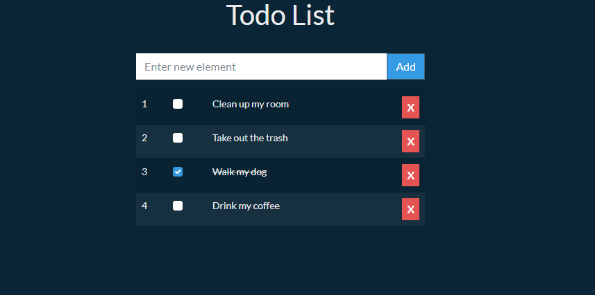

# todo-app-angular

Create a Todo List application using Angular framework.

Live demo: https://mf256.github.io/todo-app-angular

## Table of contents

- [General info](#general-info)
- [Technologies](#technologies)
- [Features](#features)
- [Screenshots](#screenshots)
- [Setup](#setup)
- [Status](#status)
- [License](#license)

## General info

The goal of this project is to build a simple Todo List application using the Angular framework.

## Technologies

- [Angular](https://angular.io/)
- [Bootstrap](https://getbootstrap.com/)
- [Bootswatch](https://bootswatch.com/)
- [Prettier](https://prettier.io)

## Features

- Add new item
- Set item as done
- Remove item

## Screenshots

## Setup

How to run this project.

1. Install [Angular CLI](https://github.com/angular/angular-cli)

2. Clone this repo

3. To run, go to project folder and run

`$ npm install`

4. Now start dev server by running -

`$ ng serve`

5. visit - http://localhost:4200/

To create production ready codes -

`$ ng build`

for more commands refer `package.json`

## Status

Project is finished.

## License

MIT
